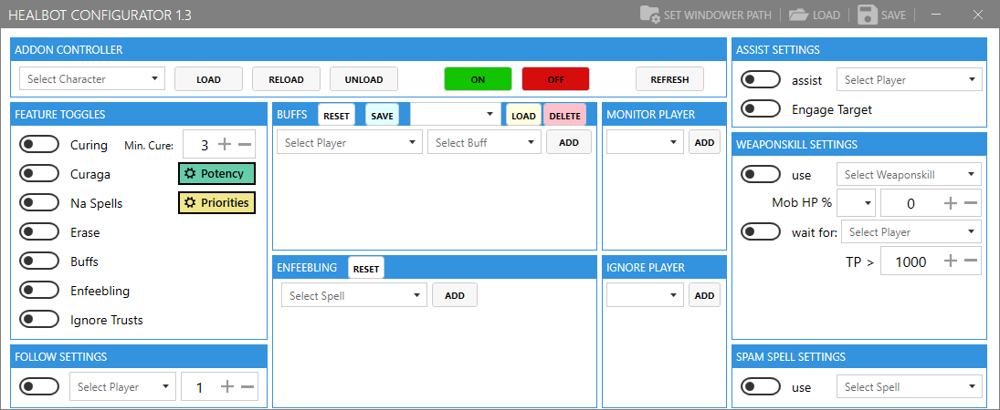

# HealbotConfigurator
FFXI tool to help configure the [Healbot Addon](https://github.com/lorand-ffxi/HealBot).

Uses the [EliteMMO API](http://www.elitemmonetwork.com/forums/) to populate various lists and provides the ability to send text to your windower instance.

## Download can be found here: [Releases](https://github.com/Icydeath/HealbotConfigurator/releases)

