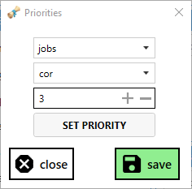

# Finally! [HealbotConfigurator2](https://github.com/Icydeath/HealbotConfigurator2) has arrived!
> You can download the latest release [here!](https://github.com/Icydeath/HealbotConfigurator2/releases)

---

# (Depreciated) HealbotConfigurator
> This version is no longer supported, check out [HealbotConfigurator2](https://github.com/Icydeath/HealbotConfigurator2)

FFXI tool to help configure the [Healbot Addon](https://github.com/lorand-ffxi/HealBot).

Uses the [EliteMMO API](http://www.elitemmonetwork.com/forums/) to populate various lists and provides the ability to send text to your windower instance.

**Notes:**

* Healbot addon needs to be installed & working correctly.
* Make sure to run HealbotConfigurator as **Administrator**.

## Download can be found here: [Releases](https://github.com/Icydeath/HealbotConfigurator/releases)

 
